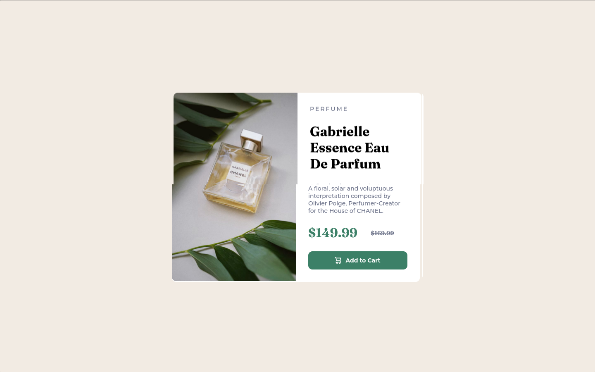
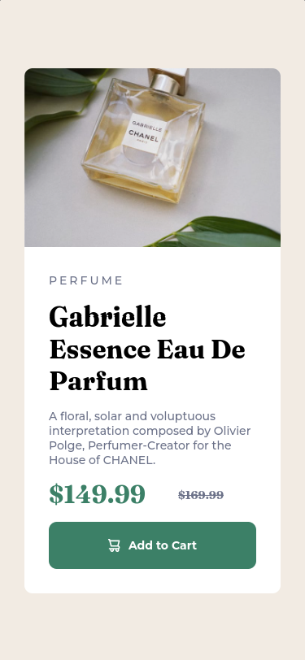

# Frontend Mentor - Product preview card component solution

This is a solution to the [Product preview card component challenge on Frontend Mentor](https://www.frontendmentor.io/challenges/product-preview-card-component-GO7UmttRfa). Frontend Mentor challenges help you improve your coding skills by building realistic projects. 

## Table of contents

- [Overview](#overview)
  - [The challenge](#the-challenge)
  - [Screenshot](#screenshot)
  - [Links](#links)
- [My process](#my-process)
  - [Built with](#built-with)
  - [What I learned](#what-i-learned)
  - [Continued development](#continued-development)
  - [Useful resources](#useful-resources)
- [Author](#author)

## Overview

### The challenge

Users should be able to:

- View the optimal layout for the site depending on their device's screen size

### Screenshot

### Links

- Solution URL: [Solution URL here]()
- Live Site URL: [Live site URL here]()

## My process

### Built with

<code></code>
<code></code>

### What I learned

In this project, I used the grid, understood better how the grid works, and was able to apply it effectively in this project.

### Continued development

I will continue with my studies of HTML and CSS.

### Useful resources

- [W3Schools](https://www.w3schools.com/css/default.asp) - 
I used W3Schools to clarify my doubts and I really liked their examples, which clarify how to use CSS properties.

- [MDN Web Docs](https://developer.mozilla.org/pt-BR/) - I'd like you to get to know MDN Web Docs, which helped me a lot in understanding HTML tags.

## Author

- Frontend Mentor - [@Otaviano-Manoel](https://www.frontendmentor.io/profile/Otaviano-Manoel)